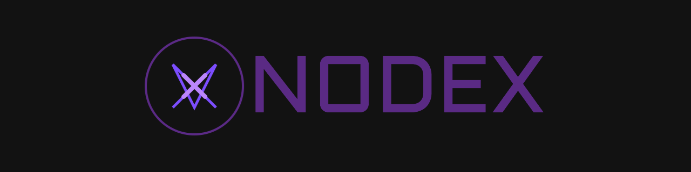

<p align="center">
 
</p>

<p align="center"><strong>An extensible and robust Express.js backend framework, designed for effortless customization and rapid deployment.</br></br>Engineered to provide scalable architecture, seamless integration, and full configurability, enabling developers to build secure, performant, and feature-rich APIs with minimal setup.</strong></p>

---

## Install

```bash
npm i @dcdavidev/nodex
```

## License

This project is licensed under the MIT License.

**Copyright (c) 2025 Davide Di Criscito**

For the full details, see the [LICENSE](LICENSE) file.
